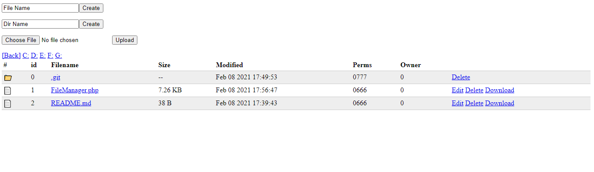

# php-mini-FileManager
php mini FileManager 8kb

* Login
* Edit
* Delete
* Download
* upload
* create new dir
* create new file
* windows drives
* ...

## screen

## Install in heroku
1 - fork in github
2 - heroku > New > Create new app
3 - Deploy > Deployment method > guthub
4 - Connect
5 - Deploy Branch